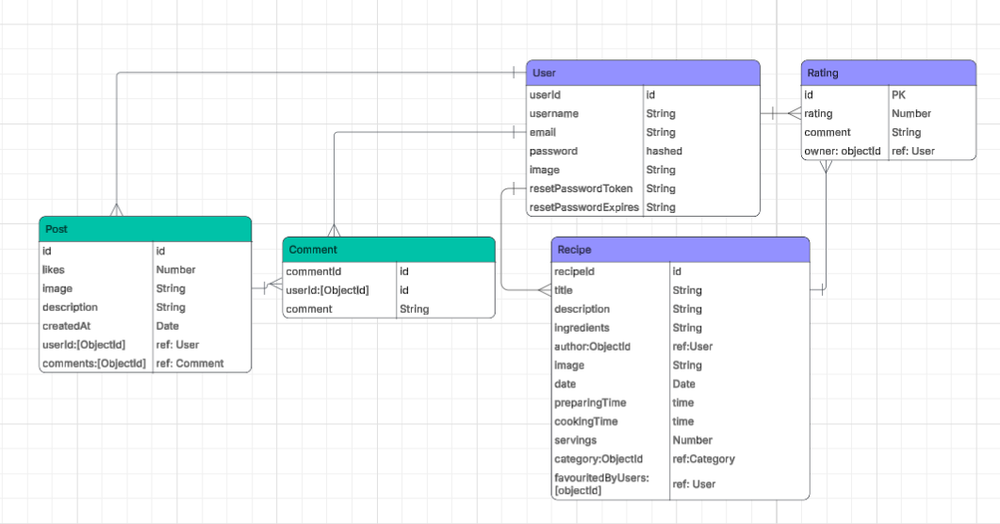
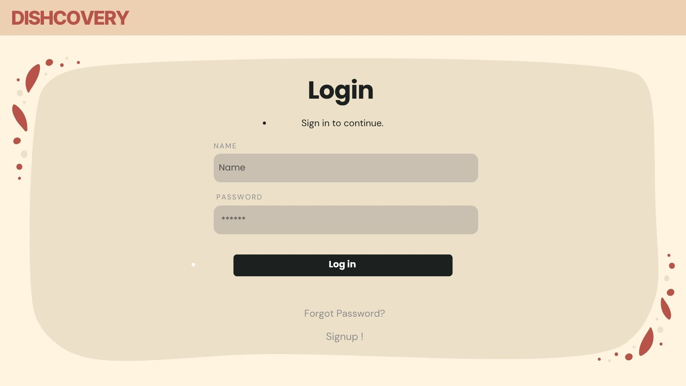
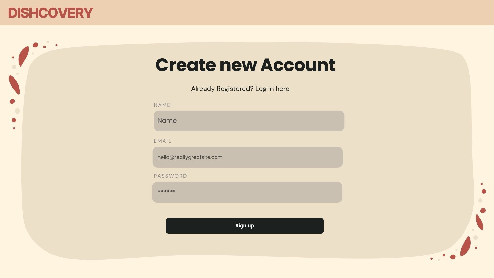
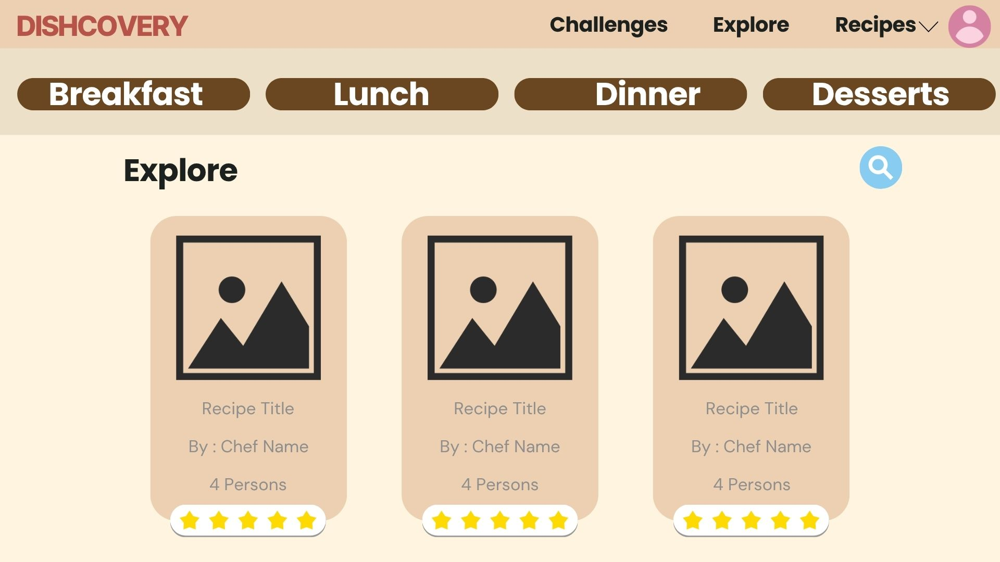
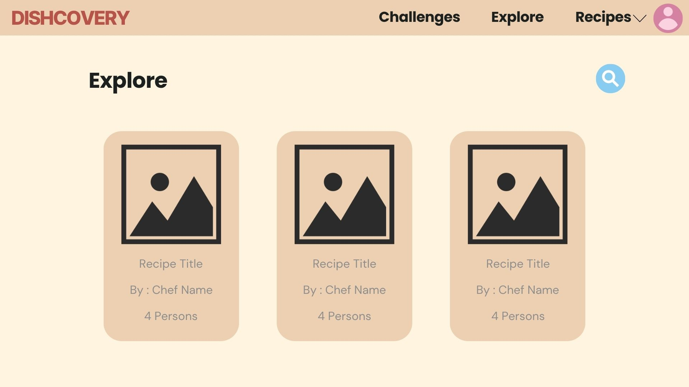
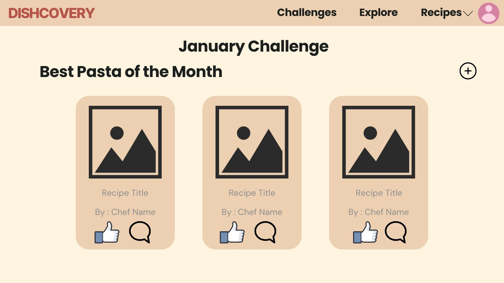
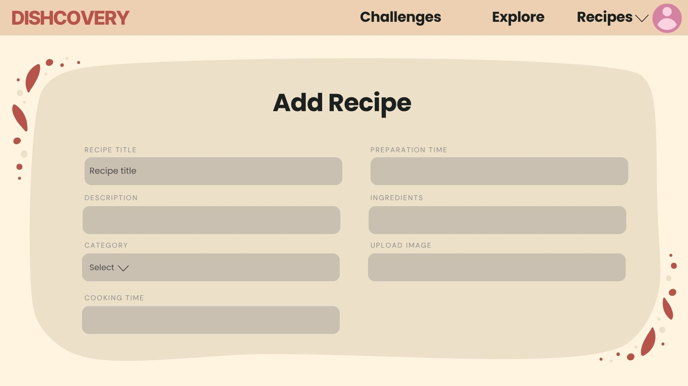
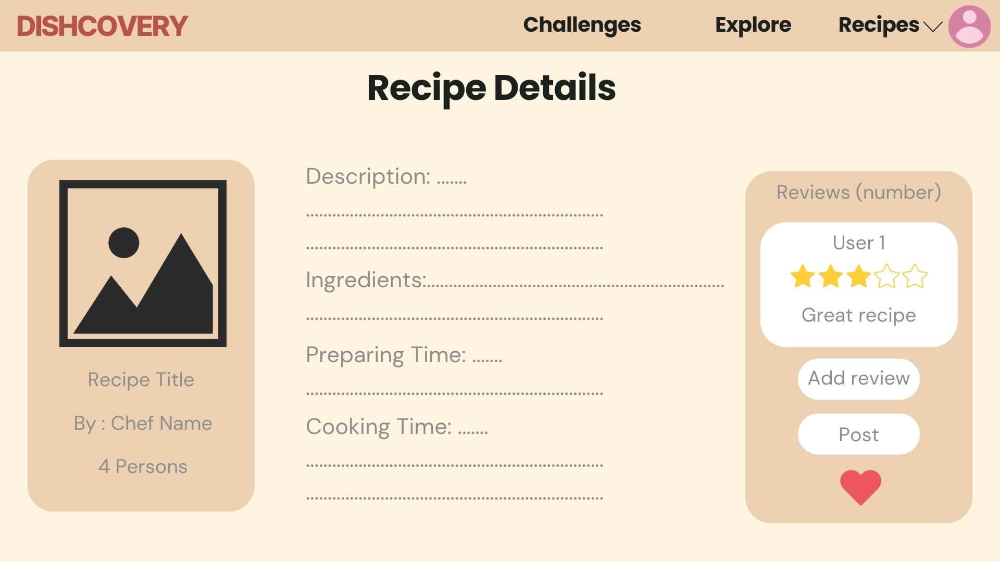
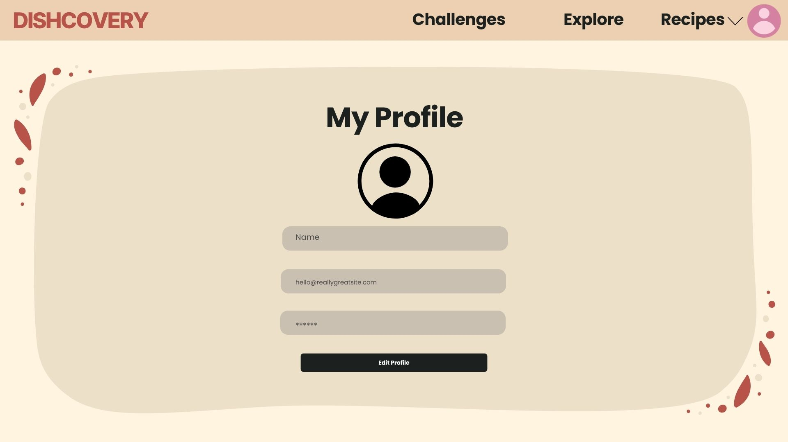

# DishcoveryFrontend
## Date: 23/10/2025
### By:
* Fatima Zaid
* Eman Qarooni
* Fatima Ali

***

### ***Description***
####

#### Dishcovery is a collaborative recipe blog built with the MERN stack that brings food lovers together. Our platform lets users create, share, and explore recipes from around the world, complete with images, ingredients, and detailed instructions. By combining creativity and community, Dishcovery makes discovering new dishes fun, interactive, and inspiring for everyone.

***

### ***Trello:***
####
Follow the project phases in [trello](https://trello.com/invite/b/68f917991ad5df9f55bbffc2/ATTI4b2be4d785c2cd32f15c3c1f42ec660f583FE5CD/project-3-recipe-blog)

***

### ***Technologies used:***
####
* Frontend:
  * HTML
  * CSS
  * JavaScript
* Backend:
  * Node.js
  * Express.js
  * Mongoose
* Database(NoSQL):
  * MongoDB

***

### ***ERD:***
####

***

### ***Component diagram:***
####

***

### ***WireFrames:***

***

### ***Credits:***
###
